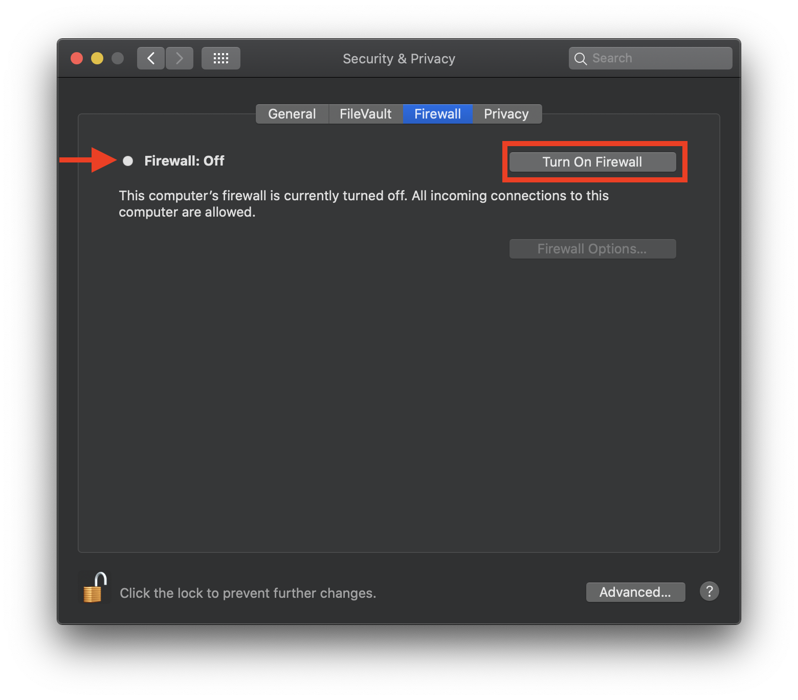

# Playwright with Jest and typescript

This setup is aimed at the test writer. For example **typescript** is used to validate test code but also to provide code completion with **Visual Studio code** so that the test writer does not have to lookup arguments to **Playwright** invocations or **Jest** assertions. This provides a starting project as well as hello world example to verify that the test authoring setup is functional. 

## Requirements

1. MacOS **Brew** found here [https://brew.sh/](https://brew.sh/)
2. Node.js version 12 or higher
    - (preferred option) One option is to use nvm (node version manager) found here [https://github.com/nvm-sh/nvm#installing-and-updating](https://github.com/nvm-sh/nvm#installing-and-updating) Note: this is preferred since some **Node.js** packages are only compatible with specific major version of **Node.js** 
    - Another option is to install Node.js for macos via a package manager such as **Brew** [https://nodejs.org/en/download/package-manager/#macos](https://nodejs.org/en/download/package-manager/#macos)

## Creating project from the GiHub template
 Created a new project on **GitHub** from this project template as shown here [creating-a-repository-from-a-template](https://docs.github.com/en/github/creating-cloning-and-archiving-repositories/creating-a-repository-from-a-template)

1. On **GitHub**, navigate to the main page of the repository [https://github.com/ltenfield/playwright-jest-ts-cli](https://github.com/ltenfield/playwright-jest-ts-cli)

2. Above the file list, click Use this template
[](https://docs.github.com/en/github/creating-cloning-and-archiving-repositories/creating-a-repository-from-a-template)

3. Use the Owner drop-down menu, and select the account you want to own the repository.
[](https://docs.github.com/en/github/creating-cloning-and-archiving-repositories/creating-a-repository-from-a-template)

4. Type a name for your repository, and an optional description.
[](https://docs.github.com/en/github/creating-cloning-and-archiving-repositories/creating-a-repository-from-a-template)

5. Finish answering the questions as shown here [creating-a-repository-from-a-template](https://docs.github.com/en/github/creating-cloning-and-archiving-repositories/creating-a-repository-from-a-template)

## Cloning the newly created project from GitHub
Now it's time to clone your newly created project.
> Note: you can always simply clone my project [playwright-jest-ts-cli](https://github.com/ltenfield/playwright-jest-ts-cli) and change the **GitHub** *origin* and push to a new project you created instead of creating the project from the template on **GitHub**.

## Initializing Node.js modules
Now it's time to `npm install` the node modules from `package.json` within the project's root directory
```sh
▶ node --version
v14.15.4

▶ npm --version
7.6.1

▶ npm install

added 6 packages, and audited 639 packages in 23s

28 packages are looking for funding
  run `npm fund` for details

found 0 vulnerabilities
```
## Jest Playwright configuration
 The Playwright test runner is configured in [jest-playwright-config.js](jest-playwright.config.js) under `launchOptions >> headless` to `true` to run in headless mode. More details about the Jest Playwright configuration is found here [https://github.com/playwright-community/jest-playwright/#configuration](https://github.com/playwright-community/jest-playwright/#configuration)

> Note: browsers are always launched *incognito* so that the browser retains *no state at all* including cookies, local database and caching.

> Note: different browsers can be configured to run under `browsers` as an array so possibly all 3 browser types can run by repeating the tests for each browser.

> Note: the *webkit* browser configuration when executing test within MacOS is **Safari**
```
module.exports = {
  //browsers: ["chromium", "firefox", "webkit"],
  browsers: ["chromium"],
  devtools: true,
  exitOnPageError: false, // GitHub currently throws errors
  launchOptions: {
    headless: true,
    slowMo: 100,
  }
}
```
## Jest run CLI (headless)
Run **Jest** from the command line headless, no browser window appears.
```sh
▶ npx jest
 PASS   browser: chromium  tests/example.test.ts
  Google.com searching
    ✓ searching agile should be an adjective (1748 ms)
    ✓ searching proficient should be an adjective (1131 ms)

Test Suites: 1 passed, 1 total
Tests:       2 passed, 2 total
Snapshots:   0 total
Time:        5.641 s, estimated 748 s
Ran all test suites.
```
## MacOS Allow browser to accept debug connection
When a debug session is started with *playwright-jest* after the browser is launched a network connection is established from the *playwright-jest* to the browser. This usually causes this dialog to appear.


## MacOS firewall allow specific playwright browser

Since many versions of the supported browsers exist in playwright browser cache from installs, updates and even specific browser version requests from a jest-playwright configuration then when debugging the MacOS firewall must be configured to prevent *allow browser to accept incoming network connection* dialog to appear.

### The cached browser binaries
```sh
▶ ls ~/Library/Caches/ms-playwright
chromium-799411 chromium-833159 chromium-854489 firefox-1171    firefox-1221    firefox-1234    webkit-1347     webkit-1423
chromium-815036 chromium-844399 ffmpeg-1005     firefox-1188    firefox-1225    webkit-1343     webkit-1402     webkit-1438
```

### Skip browser downloads
In certain cases, it is desired to avoid browser downloads altogether because browser binaries are managed separately. More details here [managing-browser-binaries](https://playwright.dev/docs/installation/#managing-browser-binaries)

This can be done by setting PLAYWRIGHT_SKIP_BROWSER_DOWNLOAD variable before installation.
```sh
# Linux/macOS
$ PLAYWRIGHT_SKIP_BROWSER_DOWNLOAD=1 npm i -D playwright

# Windows
$ set PLAYWRIGHT_SKIP_BROWSER_DOWNLOAD=1
$ npm i -D playwright
```

### Allowing specific browser though firewall (recommended)
Find the browser binary where you want to prevent the firewall connection dialog here `~/Library/Caches/ms-playwright` and open `system preferences > Security & Privacy` then select `Firewall` to get this dialog.


Click on the lock in the lower left hand corner then you get this password prompt dialog.


Then you enter your password and you get the unlocked symbol in the lower left hand corner as shown here. Then you select the `Firewall Options...` button


Then you select the `Firewall Options...` button 


and you select the browser from the playwright browser binaries found here `~/Library/Caches/ms-playwright`


Then you select the executable as shown here


And click the blue *Add* button and you get


Then you should be able to run `jest-playwright` tests without the dialog asking you if you want to accept incoming network connections for the browser

## Easy way to allow all browser incoming network connections (not recommended)
Simply disable the firewall like by navigating to the Security & privacy Firewall dialog. And unlock the dialog as previously shown


Then you click on the *Turn Off Firewall* button and you get



Then no more trouble o run `jest-playwright` tests without the dialog asking you if you want to accept incoming network connections for the browser

> Note: you must turn your firewall back on after testing.

## Jest playwright run CLI debug mode

Start the `playwright` browser debug session by prefixing the jest test runner command with `PWDEBUG=1` to start playwright in debug mode with a debugging window and make the browser visible even though the configuration is for a headless browser test

> Note: `npx jest` is a way of running `jest` installed within your project instead of using `npm test`

```sh
▶ PWDEBUG=1 npx jest

 RUNS   browser: chromium  tests/example.test.ts
```
Then you get a blank **incognito** mode chrome browser and a playwright debug window
> Note: chrome browser is launched in incognito mode for web testing to avoid side effects from previous testing sessions. As such all cookies, sessions etc will have to be created from scratch. For example, you can always setup jest to login before each test.  

Then you hit the single step button as shown in debug window for the first test within `example.test.ts` as shown here


When you complete your first test you should see the following output in the bottom pane of the playwright debug window indicating that you have successfully completed the test as shown here


And the browser should look like this, showing definition for agile along with the adjective attribute and the css path highlighted in a grey box `div.vmod > div.vmod:first-child i > span`

